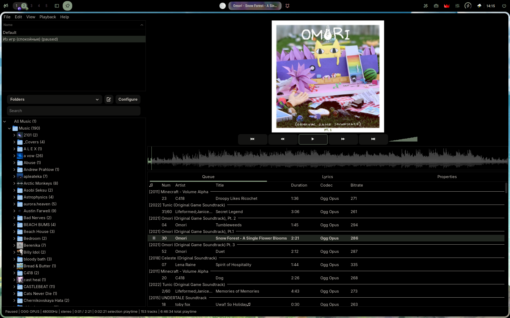

# DeadBeef config
## preview

## How to install
### Arch linux
----
#### 1) install deadbeef and waveform plugin via aur (yay for example)
**!!Warning!!** These packages may be compromised. Check the safety of the packages before installation
```bash
yay -S --needed deadbeef deadbeef-plugin-waveform-gtk3-git
```
#### 2) copy deadbeef config folder to ~/.config/
```bash
mkdir -p ~/.config/deadbeef/
git clone https://github.com/ini-qstm/deadbeef-config.git ~/.config/deadbeef/
```

### Debian (Ubuntu, Mint, etc)
----
#### 1) install [deadbeef](https://sourceforge.net/projects/deadbeef/files/Builds/1.10.2/linux/deadbeef-static_1.10.2-1_amd64.deb/download) and [waveform plugin](https://github.com/cboxdoerfer/ddb_waveform_seekbar)
> If you dont want to install any plugins, you can just skip it. Dont forget to change seekbar to default
#### 2) copy deadbeef config folder to ~/.config/
```bash
mkdir -p ~/.config/deadbeef/
git clone https://github.com/ini-qstm/deadbeef-config.git ~/.config/deadbeef/
```

### Windows
----
Please, use something more popular like foobar2000, aimp, etc. You dont need deadbeef

### Other OS
----
> Waveform plugin only awaible on linux, so you will need to change seekbar to default
#### 1) install [deadbeef](https://github.com/DeaDBeeF-Player/deadbeef#building-deadbeef-from-source) and [waveform plugin](https://github.com/cboxdoerfer/ddb_waveform_seekbar)
#### 2) download this repo and insert to deadbeef directory

## Quick configure:
1) start deadbeef
2) edit -> preferences -> sound
select your output device
> By default, this config uses ALSA Output. Here is a brief explanation:
    ALSA: Lowest latency and highest quality. Note: This will block sound from other apps (YouTube, System sounds) while music is playing
    PipeWire/PulseAudio: Use this if you want to hear music and other apps simultaneously

3) edit -> preferences -> media library: click to plus (from below) and then select your music library 

#### If you dont like waveform seekbar or you cant install it, you need:
1) view -> click to design mode (turn on)
2) rmb click on seekbar -> replace with... -> seekbar (its a default seekbar)
3) view -> click to design mode (turn off)

plugins and manuals you can find at https://deadbeef.sourceforge.io/

## Credits
[deadbeef](https://deadbeef.sourceforge.io/)